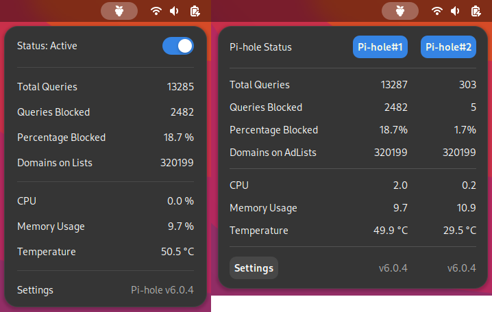

# Phi: Pi-hole Indicator for GNOME Shell

Quickly access your beloved Pi-hole from GNOME Shell. Works with Pi-hole v5 and v6.

Phi provides the following features:

- Monitor single or multiple Pi-hole instances,
- Enable/disable blocking,
- Display status and main statistics,
- Show version information of Pi-hole, and notify when there is an update.

You can also configure Phi to look for Pi-hole only in a certain network. This might be useful if your computer connects to school, work or public Wi-Fi.

## Install

You can install Phi via official page of [GNOME Shell Extensions](https://extensions.gnome.org/extension/6400/phi-pi-hole-indicator/).

## Changelog

### v2.1

- Fix check new version logic.

### v2.0

- Support Pi-hole v6. Fixes [#10].
- Fetch sensor data: CPU, memory usage and temperature. This feature requires Pi-hole v6. Fixes [#9].
- Use appropriate widgets for password/token entry.

See [CHANGELOG.md](CHANGELOG.md) for complete changelogs.

## License

Phi is distributed under the GNU General Public License, version 3.

Copyright © 2024 Ziya Genç.
